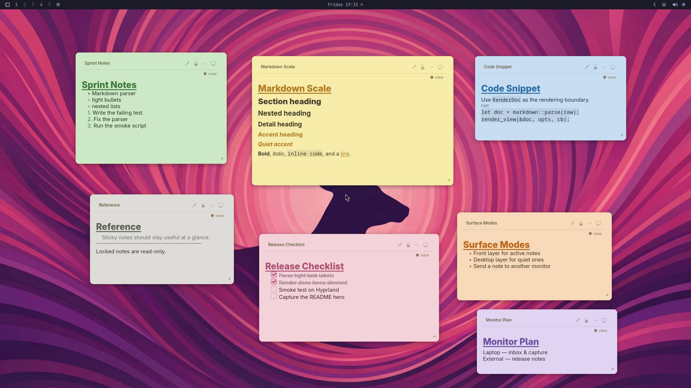

<p align="center">
  
</p>

<h1 align="center">Waynote</h1>

<p align="center"><strong>Wayland-native, markdown-based desktop sticky notes for Linux.</strong></p>

<p align="center">
  <a href="LICENSE"></a>
  <a href="https://www.rust-lang.org/"></a>
  <a href="https://wayland.freedesktop.org/"></a>
</p>

<p align="center">
  
</p>

Waynote keeps quick, glanceable notes on the desktop layer of your tiling
compositor. Notes are plain `.md` files — hackable, version-controllable, and
friendly to Obsidian and AI agents: edit a note from any editor and it refreshes
live on screen.

> [!NOTE]
> **Waynote is v0.1.0 — young, but functional.** The full feature set works; the
> interactive paths (drag/resize, click-to-edit, checkboxes, image paste, tray)
> have had limited real-world testing, so expect the occasional rough edge.
> [Issues](https://github.com/mryll/waynote/issues) and feedback are welcome.

## Why Waynote

Existing sticky-note apps target X11 desktop environments, hide your notes in a
private database, and don't speak markdown. Waynote is built for Wayland power
users instead:

- **Lives on the desktop layer** via `wlr-layer-shell` — send notes behind your
  windows or bring them to the front, show/hide all, recolour them, lock one
  read-only, move it to another monitor, and pin the ones that stay.
- **Plain markdown files.** Each note is a `.md` file with a small YAML
  frontmatter (id, color, pinned, locked, tags). Render is faithful — six
  distinct heading levels, bold/italic/strikethrough, inline code and code
  blocks, blockquotes, nested and ordered lists, links, task checkboxes (struck
  through when done), and inline images — across seven paper colours, with
  `Ctrl+B`/`Ctrl+I`/`Ctrl+K` shortcuts while editing.
- **Agent- and sync-friendly.** External edits (your editor, a script, an AI
  agent, Syncthing) are reconciled live, with conflict copies instead of silent
  overwrites. Content stays clean for git: volatile geometry is stored
  separately from the notes.
- **A single Rust binary**, hackable and easy to install.

## Compatibility

Waynote needs a compositor that implements `wlr-layer-shell`:

- ✅ **Supported:** Hyprland, Sway, river, Wayfire, niri, KDE/KWin, COSMIC.
- ❌ **Not supported:** GNOME/Mutter (no layer-shell), X11, macOS, Windows.

## Install

### Arch Linux (AUR)

The quickest path on Arch and derivatives — two packages are available, pick one:

```sh
yay -S waynote-bin   # prebuilt binary, no compilation
yay -S waynote       # builds from source
```

Either one installs the `waynote` binary, a desktop entry, the tray icon, and a
(disabled) `systemd` user unit, and pulls in the `gtk4` and `gtk4-layer-shell`
runtime dependencies automatically. Nothing else to do — skip to
[Running the app](#running-the-app).

### From source

You'll need a `wlr-layer-shell` compositor (see
[Compatibility](#compatibility)), [Rust](https://www.rust-lang.org/tools/install)
(stable), and the GTK 4 + `gtk4-layer-shell` development libraries. On Arch:

```sh
sudo pacman -S gtk4 gtk4-layer-shell rust
```

Then build, and install the desktop entry, tray icon, and systemd unit into your
home directory:

```sh
git clone https://github.com/mryll/waynote.git
cd waynote
cargo build --release
./target/release/waynote install-user-assets   # desktop entry, tray icon, systemd unit
```

## Usage

### Running the app

```sh
waynote          # or, from a source checkout: cargo run
```

Loads notes from `$XDG_DATA_HOME/waynote/notes/` (typically
`~/.local/share/waynote/notes/`). Notes are plain `.md` files — drop any
conforming markdown file in that directory and it appears on the desktop within
seconds.

### Subcommands

```sh
waynote                             # run the app
waynote new                         # create a new note (starts the app if needed)
waynote show-all | hide-all | toggle  # show / hide all notes (forwards to the app)
waynote doctor                      # run diagnostics (D-Bus, SNI tray, paths)
waynote install-user-assets         # install icon, .desktop, and systemd unit
waynote autostart on|off|status     # toggle the systemd user autostart
waynote --render-demo               # open the markdown render demo window (dev)
```

### Window-manager keybinds

The CLI verbs forward to the already-running instance (starting it if needed), so
bind them straight from your compositor:

```ini
# ~/.config/hypr/hyprland.conf
bind = SUPER, N, exec, waynote new
bind = SUPER SHIFT, H, exec, waynote hide-all
bind = SUPER SHIFT, S, exec, waynote show-all
bind = SUPER SHIFT, T, exec, waynote toggle      # hide all, or show all if any are hidden
```

Any other action — `arrange`, or per-note ones like `set-color`, `toggle-lock`,
`move-to-monitor` — is available over D-Bus:

```sh
gapplication action dev.mryll.waynote arrange
```

## How it works

Waynote opens one layer-shell surface per **(monitor × layer)** —
`front = Layer::Top`, `desktop = Layer::Background` — each hosting a stationary
canvas. The Wayland input region is limited to the note rectangles, so the rest
of the surface stays click-through. Notes are data models: moving a note across
monitors or layers recreates its view in the target surface rather than
reparenting widgets, which avoids ghost frames.

```
src/
  main.rs              # app entry point + CLI routing
  app/
    controller.rs      # central state: notes, watcher, tray, actions
    presenter.rs       # places note cards onto surfaces
    tray.rs            # SNI tray item (ksni)
  core/
    markdown.rs        # pulldown-cmark → IR
    note.rs            # note domain model
    reconcile.rs       # diff-and-reconcile for file-watcher changes
  platform/
    render.rs          # GTK TextBuffer renderer (markdown IR → widgets)
    watcher.rs         # inotify file watcher + debounce
    paths.rs           # XDG path resolution
    doctor.rs          # diagnostics
    surfaces.rs        # layer-shell surfaces
```

The design follows Vertical Slice Architecture — user actions are slices, while
filesystem, surfaces, tray, and markdown render are shared platform modules —
keeping domain logic unit-testable without a display.

## Status

Waynote 0.1.0 is feature-complete: notes on the Wayland desktop with faithful
markdown rendering, persistence with live file-watching and conflict copies,
per-note colour / lock / layer / move-to-monitor controls, a system-tray item,
image paste, and autostart. Verified live on Hyprland and Sway.

Planned next: broader compositor verification, optional tags and filters, and
distro packaging beyond the AUR.

## Documentation

- [Design](docs/specs/2026-06-24-waynote-design.md) — product behavior,
  persistence model, architecture, and scope
- [Repaint contract](docs/notes/repaint-contract.md) — the validated redraw and
  input-region sequence, and its caveats
